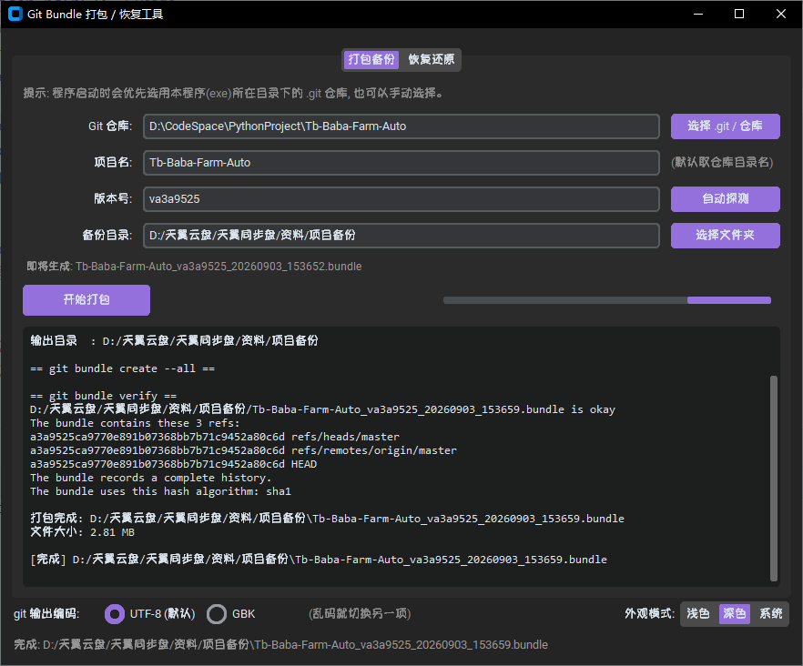

# 📂 Git Bundle 打包 / 恢复工具

一款基于Git Bundle 备份与还原的图形化工具。无需命令行，点点鼠标即可完成 Git 仓库的打包、验证与恢复。

---

## 预览



---

## 功能特性

- **一键打包备份** — 自动探测版本号，按 `项目名_版本号_时间戳.bundle` 命名输出
- **智能验证** — 打包后自动执行 `git bundle verify`，确保 bundle 完整可用
- **恢复还原** — 支持从 `.bundle` 文件一键恢复仓库
- **目录选择器** — 可视化选择 `.git` 仓库、输出目录，无需手输路径
- **自动探测** — 自动读取仓库最新 commit hash 作为版本号
- **编码切换** — git 输出乱码时可在 UTF-8 / GBK 之间一键切换
- **深浅色主题** — 支持浅色 / 深色 / 跟随系统三种外观模式
- **美观 UI** — 基于 CustomTkinter + Lavender 主题，界面现代简洁

---

## 快速开始

### 1. 安装依赖

```bash
pip install -r requirements.txt
```

### 2. 运行程序

```bash
python main.py
```

### 3. 打包为可执行文件（可选）

#### Windows

双击 `build.bat`，或命令行执行：

```bat
build.bat
```

输出：`dist\GitBundleBackuper.exe`

#### Linux / macOS

执行项目自带的 `.sh` 打包脚本：

```bash
bash build.sh
```

> 首次使用若提示无执行权限，先赋予权限再执行：
> ```bash
> chmod +x build.sh
> ./build.sh
> ```
> 两种方式等价，任选其一。

输出：`dist/GitBundleBackuper`（无 `.exe` 后缀）

#### 跨平台通用方式

任何系统均可手动调用 PyInstaller 配置（spec 内已自动收集 `customtkinter` / `PIL` 及 `themes/lavender.json` 资源，跨平台兼容）：

```bash
python -m PyInstaller --noconfirm --clean GitBundleBackuper.spec
```

---

## 使用说明

| 步骤 | 操作 |
|------|------|
| 选择仓库 | 点击 **选择 .git / 仓库**，定位到目标 Git 仓库目录 |
| 确认项目名 | 自动读取文件夹名，可手动修改 |
| 确认版本号 | 点击 **自动探测** 获取最新 commit hash |
| 选择备份目录 | 点击 **选择文件夹**，指定 bundle 输出位置 |
| 开始打包 | 点击 **开始打包**，等待验证完成 |

---

## 技术栈

- [CustomTkinter](https://github.com/TomSchimansky/CustomTkinter) — 现代风格 Tkinter 扩展
- [PyInstaller](https://pyinstaller.org/) — 打包为独立可执行文件
- Git Bundle — Git 原生归档方案，无需完整仓库历史即可传输

---

## 项目结构

```
git_bundle_backuper/
├── main.py                # 程序入口
├── core.py                # 业务逻辑（打包/恢复/验证）
├── config.json            # 用户本地配置（由程序自动生成）
├── requirements.txt       # Python 依赖
├── build.bat              # Windows 一键打包脚本
├── build.sh               # Linux / macOS 一键打包脚本
├── GitBundleBackuper.spec # PyInstaller 配置
├── themes/                # UI 主题文件（lavender.json）
├── test/                  # 测试脚本
├── docs/                  # 文档与截图
└── README.md              # 本文件
```

---

## 许可证

本项目基于 [MIT License](LICENSE) 开源，个人工具，供学习参考使用。

Copyright (c) 2026 ShoutBeast
